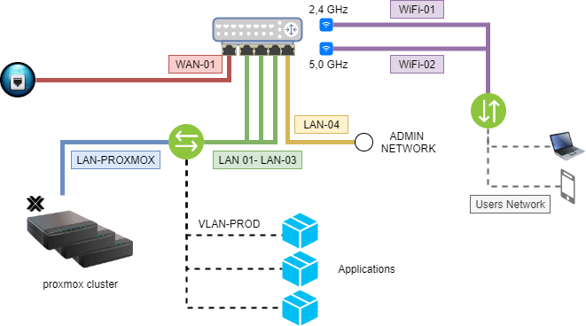

Konfiguracja routera brzegowego
=========

Interfejsy
=========
| Interface | Name | Bridge | vlan | ssid |
|---|---|---|---|---|
| ether1 | WAN-01 |   |   |   |
| ether2  | LAN-01 | LAN-PROXMOX | VLAN-PROD (id:10) |   |
| ether3  | LAN-02 | LAN-PROXMOX | VLAN-PROD (id:10) |   |
| ether4  | LAN-03 | LAN-PROXMOX | VLAN-PROD (id:10) |   |
| ether5  | LAN-04 |   |   |   |
| wlan1  | WiFi-01 | LAN-USERS |   | Users Wifi Network |
| wlan2  | WiFi-02 | LAN-USERS |   | Users Wifi Network |

Konfiguracja serverów dhcp
=========
| Network | Name | Client dhcp | Server dhcp |
|---|---|---|---|
| 192.168.100.0/24 | WAN | X |   |
| 10.0.0.0/24  | Mikrotik Network |   |   |
| 10.1.0.0/24  | Users Network |   | X |
| 10.2.0.0/24  | ProxMox Network |   | X |
| 10.3.0.0/24  | Prod Application Network |   | X |

[Powrót](../../README.md)